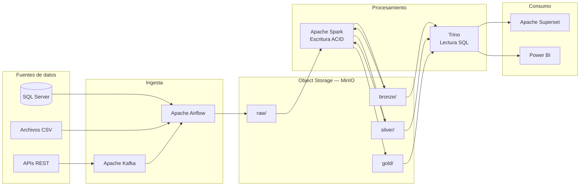
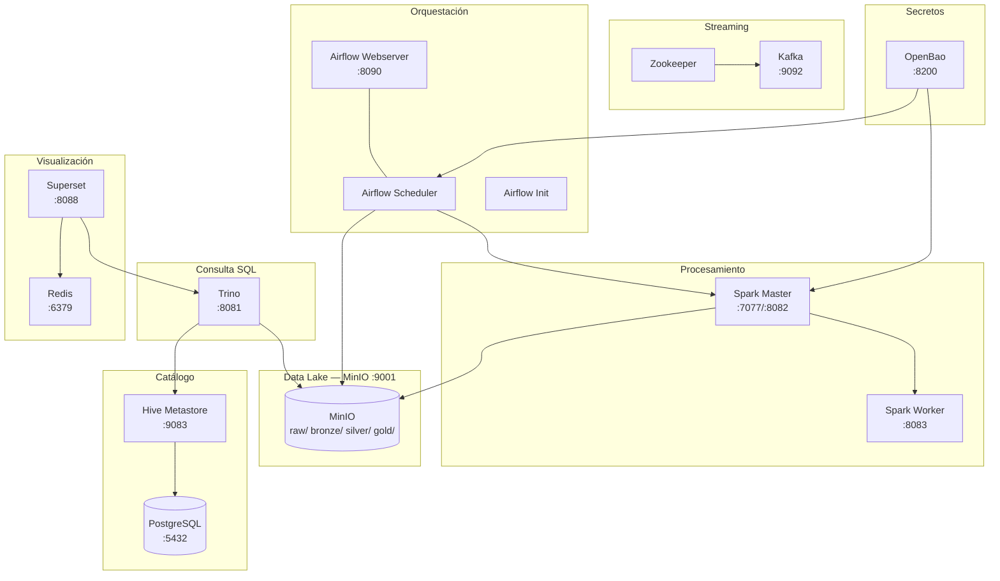
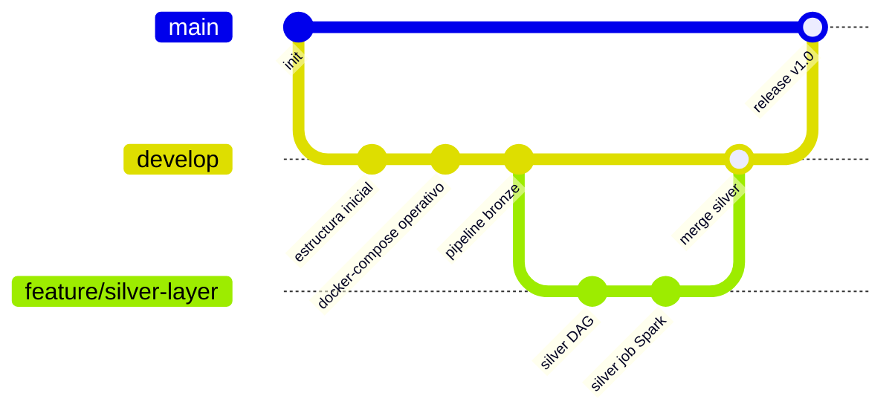
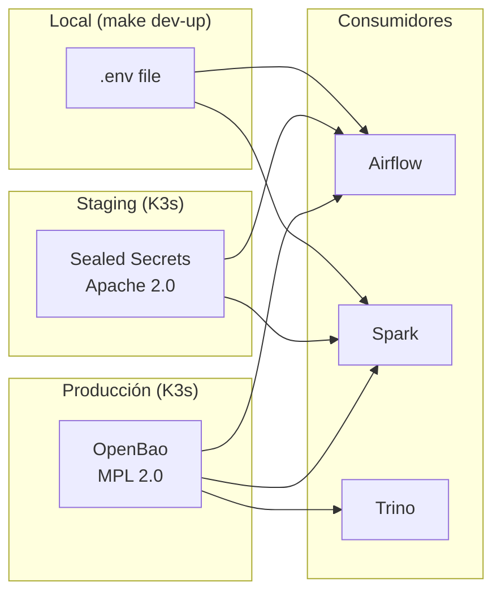
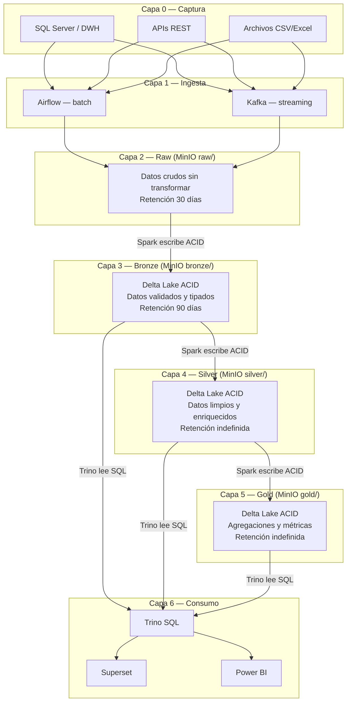
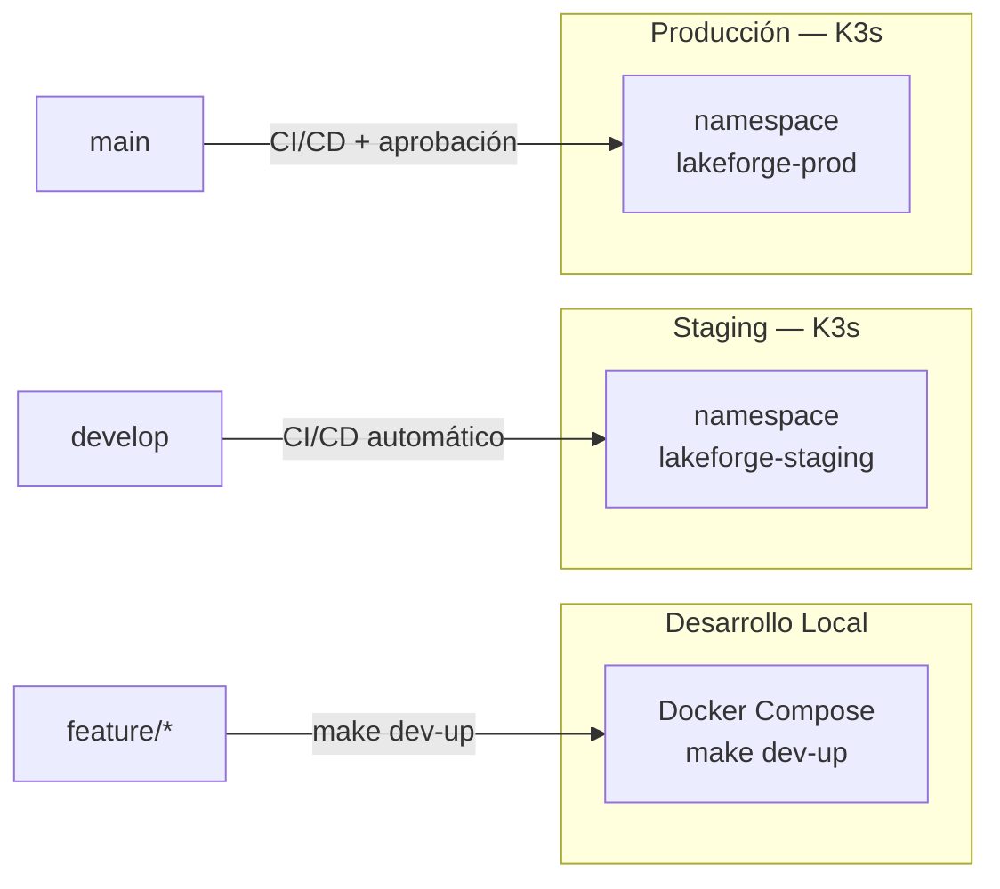
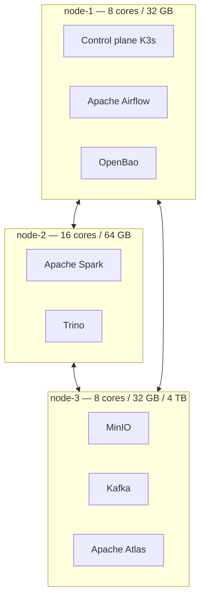
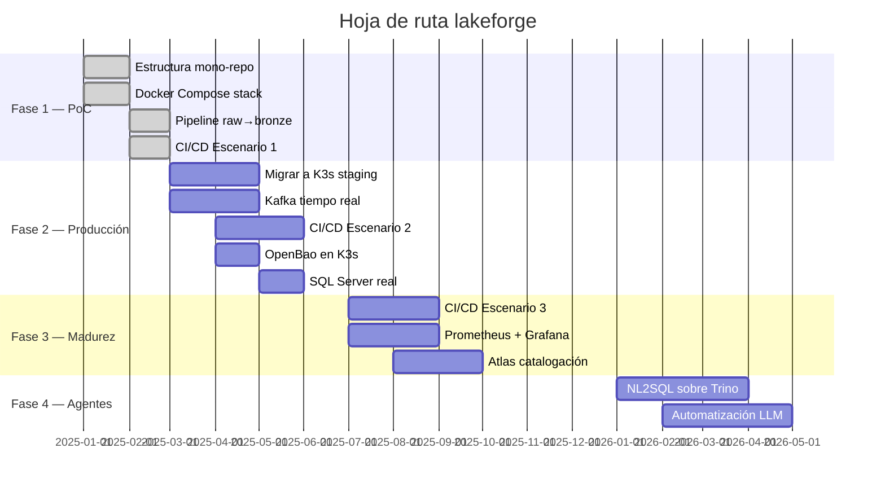

# Lakeforge — Arquitectura Lakehouse Open Source Stack

**ALEPH SERVER LTDA. — Documento técnico de referencia**
Versión 2.0 — Stack validado y operativo en PoC

---

## Convenciones de madurez

| Badge | Significado |
|---|---|
| `PoC / Dev` | Validado en entorno local, no productivo aún |
| `Producción` | Desplegado y estable en producción |
| `Fase futura` | Planificado para etapa siguiente |

---

## 1. Introducción

Lakeforge es el mono-repositorio oficial de ALEPH SERVER LTDA. para el stack de datos Lakehouse open source. Centraliza el código de orquestación (Apache Airflow), procesamiento (Apache Spark), consulta (Trino), esquemas (Hive Metastore) e infraestructura (K3s/Helm) bajo un único repositorio Git con pipelines CI/CD agnósticos por dominio.

El diseño incorpora siete gaps identificados durante el análisis de arquitectura: ambientes formalizados, versionado de datos, gestión de secretos empresarial, dependencias Python estandarizadas, observabilidad, retención de datos y onboarding de desarrolladores.

---

## 2. Stack técnico completo

| Componente | Versión | Estado | Notas |
|---|---|---|---|
| Apache Kafka | 7.6.1 (CP) | `PoC / Dev` | Streaming tiempo real; reemplaza RabbitMQ |
| Apache Airflow | 2.9.1 | `Producción` | Orquestación ETL batch; DAGs en airflow/dags/ |
| MinIO | 2024-04 | `PoC / Dev` | Object storage S3-compatible; buckets raw/bronze/silver/gold |
| Delta Lake | 3.2.0 | `PoC / Dev` | Tablas ACID sobre MinIO; time travel; schema enforcement |
| Hive Metastore | 4.0.0 | `PoC / Dev` | Catálogo central; migraciones DDL numeradas en hive/schemas/ |
| Apache Spark | 3.5.3 | `PoC / Dev` | ETL distribuido; jobs en spark/jobs/; motor de escritura ACID |
| Trino | 448 | `PoC / Dev` | Motor SQL federado; file metastore local; consulta Delta Lake |
| Apache Atlas | — | `PoC / Dev` | Linaje de datos y catalogación de metadatos |
| Apache Ranger | — | `Producción` | Control de acceso; políticas por tabla/columna/fila |
| Great Expectations | — | `PoC / Dev` | Calidad de datos; integrado en pipeline CI/CD Escenario 2+ |
| Power BI | — | `Producción` | BI empresarial; conectado a Trino vía ODBC |
| Apache Superset | 3.1.3 | `PoC / Dev` | Exploración Big Data; integrado con Trino |
| Redis | 7.2 | `PoC / Dev` | Caché de consultas para Superset |
| OpenBao | 2.0.0 | `Producción` | Fork OSS de Vault; MPL 2.0; Linux Foundation; rotación + auditoría |
| Sealed Secrets | — | `PoC / Dev` | Secretos cifrados en Git para staging |
| Graylog | — | `Producción` | Centralización de logs de todo el stack |
| Prometheus + Grafana | — | `Fase futura` | Métricas de infraestructura y alertas operacionales |
| Docker Compose | — | `PoC / Dev` | Entorno local; definido en infra/docker-compose/ |
| K3s / Kubernetes | — | `Producción` | Plataforma de producción; manifiestos en infra/k3s/ |

---

## 3. Flujo de datos end-to-end



### Regla fundamental

> **Spark escribe. Trino lee.**

| Operación | Motor |
|---|---|
| Escribir en Delta Lake (ACID) | **Spark** |
| MERGE / UPSERT | **Spark** |
| Streaming Kafka → Delta | **Spark Structured Streaming** |
| Consultas SQL ad-hoc | **Trino** |
| Consultas federadas multi-fuente | **Trino** |

---

## 4. Arquitectura del stack de servicios



---

## 5. Mono-repo lakeforge

```
lakeforge/
├── airflow/
│   ├── dags/               # DAGs Python de Airflow
│   ├── plugins/            # Operadores y hooks custom
│   ├── tests/              # Tests unitarios de DAGs
│   └── requirements.txt    # Dependencias Python (pinning estricto)
├── spark/
│   ├── jobs/               # Scripts PySpark
│   ├── tests/              # Tests con pytest + chispa
│   └── requirements.txt    # Dependencias Python de Spark
├── trino/
│   └── catalog/            # Configuraciones de conectores
├── hive/
│   └── schemas/            # DDL numeradas (convención Flyway)
├── superset/
│   └── dashboards/         # Exports JSON de dashboards
├── infra/
│   ├── k3s/                # Manifiestos Kubernetes
│   ├── docker-compose/     # Stack local completo
│   └── helm/               # Charts Helm personalizados
├── .ci/
│   ├── scripts/            # Scripts bash portables (lógica CI/CD)
│   └── pipelines/          # Adaptadores YAML por plataforma
├── docs/                   # Documentación técnica
├── Makefile                # Interfaz unificada de comandos
└── README.md               # Guía de onboarding
```

### Makefile — comandos principales

```bash
make setup           # Crea .venv e instala dependencias (Python 3.12)
make dev-up          # Levanta stack Docker Compose
make dev-down        # Detiene stack
make lint-all        # Lint completo (Ruff + sqlfluff)
make test-all        # Tests completos
make detect-secrets  # Escaneo de secretos
make deploy-staging  # Deploy K3s staging
make deploy-prod     # Deploy K3s producción (requiere confirmación)
```

---

## 6. GitOps y CI/CD agnóstico

### Principio de agnosis

El CI/CD opera en dos niveles independientes:

- **Nivel 1 — lógica portable:** scripts bash en `.ci/scripts/` con la lógica real de lint, test, build y deploy.
- **Nivel 2 — adaptadores de plataforma:** archivos YAML en `.ci/pipelines/` que solo invocan los scripts del Nivel 1.

**Plataformas soportadas:** Woodpecker CI, Bitbucket Pipelines, Azure DevOps, GitHub Actions.

### Estrategia de branching



| Branch | Ambiente destino | Pipeline mínimo |
|---|---|---|
| `feature/*` | Local (Docker Compose) | Lint + secrets check |
| `develop` | Staging (K3s namespace) | Escenario 1 + deploy staging |
| `main` | Producción (K3s namespace) | Escenario 2/3 + smoke test |

### Pipelines por dominio

| Carpeta | Trigger | Pasos |
|---|---|---|
| `airflow/dags/` | Push a branch | Lint → test DAG → sync PVC Airflow |
| `spark/jobs/` | Push a branch | Lint → test PySpark → build imagen → deploy |
| `trino/catalog/` | Push a branch | Validar YAML → reload conector |
| `hive/schemas/` | Push a branch | Validar DDL → migración via DAG Airflow |
| `infra/k3s/` | Push a main | Validar manifiestos → kubectl apply |

---

## 7. Escenarios CI/CD

### Progresión recomendada

- **Mes 1-2:** Escenario 1 — instalar el hábito sin fricción
- **Mes 3-4:** Escenario 2 — agregar tests a medida que se escribe código nuevo
- **Mes 6+:** Escenario 3 — cuando el stack esté estable en staging

### Matriz de requisitos

| Requisito | E1 Básico | E2 Intermedio | E3 Avanzado |
|---|---|---|---|
| Lint (Ruff / sqlfluff) | Bloquea | Bloquea | Bloquea |
| detect-secrets | Bloquea | Bloquea | Bloquea |
| Sintaxis DAG válida | Bloquea | Bloquea | Bloquea |
| Tests unitarios (pytest) | — | Bloquea | Bloquea |
| Cobertura mínima 40% | — | Bloquea | Bloquea |
| Schema Delta válido (GE) | — | Bloquea | Bloquea |
| Cobertura mínima 70% | — | — | Bloquea |
| Tests de integración | — | — | Bloquea |
| Deploy staging OK | — | — | Bloquea |
| Smoke test en staging | — | — | Bloquea |
| Tiempo estimado | < 2 min | 4-8 min | 15-25 min |

---

## 8. Stack técnico por equipo

### Desarrollador de DAGs (Airflow)

```
Python 3.12 (venv aislado)
Airflow 2.9.1
Ruff — linter y formatter
pytest — tests unitarios
pre-commit — hooks automáticos
```

### Desarrollador de jobs Spark

```
Python 3.12 (venv aislado)
PySpark 3.5.3 + delta-spark 3.2.0
chispa — testing PySpark
pytest + pytest-cov
Ruff — linter y formatter
```

### Analista SQL / Trino

```
DBeaver o DataGrip (conector Trino nativo)
trino-cli — cliente CLI oficial
sqlfluff — linter SQL
```

### Ingeniero de infraestructura

```
kubectl + helm
k9s — UI terminal para K8s
kubectx — cambio rápido entre contextos
Docker Desktop
```

---

## 9. Gestión de secretos



| Ambiente | Herramienta | Licencia | Notas |
|---|---|---|---|
| Local | `.env` file | — | Nunca commitear |
| Staging | Sealed Secrets | Apache 2.0 | Cifrado en Git, descifrado por K3s |
| Producción | **OpenBao** | MPL 2.0 | Fork Vault, Linux Foundation, API compatible |

### Por qué OpenBao y no HashiCorp Vault

HashiCorp cambió Vault a BSL v1.1 en agosto 2023 — ya no es open source. OpenBao es el fork MPL 2.0 bajo Linux Foundation con API 100% compatible. Sin restricciones BSL.

### Cliente Python (hvac)

```python
import hvac, os

client = hvac.Client(
    url=os.getenv("OPENBAO_ADDR", "http://openbao:8200"),
    token=os.getenv("OPENBAO_TOKEN"),
)
secret = client.secrets.kv.v2.read_secret_version(path="sqlserver/credentials")
password = secret["data"]["data"]["password"]
```

---

## 10. Capas del Lakehouse



---

## 11. Gobernanza y calidad de datos

### Apache Atlas — `PoC / Dev`
- Linaje de datos y catalogación de metadatos
- Clasificaciones para datos sensibles: PII, financiero, confidencial

### Apache Ranger — `Producción`
- Control de acceso centralizado para Trino, Spark y Hive Metastore
- Políticas a nivel de base de datos, tabla, columna y fila
- Auditoría completa. Integración con LDAP / Active Directory

### Great Expectations — `PoC / Dev`
- Validación de calidad en el pipeline CI/CD desde Escenario 2
- Valida schema, nulos, rangos y unicidad antes de capas silver/gold

### Retención de datos

| Capa | Retención | Mecanismo |
|---|---|---|
| `raw/` | 30 días | Lifecycle policy en MinIO |
| `bronze/` | 90 días | Lifecycle policy en MinIO |
| `silver/` | Indefinido | Política de negocio |
| `gold/` | Indefinido | Política de negocio |
| Delta versions | 7 días | VACUUM DAG en Airflow |

---

## 12. Observabilidad

### Graylog — `Producción` (activo)
- Centralización de logs via GELF/Syslog
- Dashboards por componente: Airflow, Spark, Trino, Kafka
- Alertas por patrones de error

### Prometheus + Grafana — `Fase futura`
- Métricas de infraestructura K3s
- Métricas de pipelines Airflow (duración, tasa de fallos)

---

## 13. Ambientes y despliegue



| Ambiente | Infraestructura | Branch | Deploy |
|---|---|---|---|
| Local | Docker Compose | `feature/*` | `make dev-up` |
| Staging | K3s namespace staging | `develop` | CI/CD automático |
| Producción | K3s namespace prod | `main` | CI/CD + aprobación |

### Servicios disponibles tras make dev-up

| Servicio | URL | Credenciales |
|---|---|---|
| Airflow UI | http://localhost:8090 | admin / admin |
| Trino UI | http://localhost:8081 | — |
| MinIO Console | http://localhost:9001 | minioadmin / minioadmin |
| Superset | http://localhost:8088 | admin / admin |
| OpenBao | http://localhost:8200 | token: dev-root-token |
| Spark Master | http://localhost:8082 | — |

---

## 14. Requisitos de hardware

### PoC — Servidor único

| Componente | Mínimo | Recomendado |
|---|---|---|
| CPU | 8 cores | 16 cores |
| RAM | 32 GB | 64 GB |
| Disco OS | 100 GB SSD | 200 GB SSD |
| Disco datos (MinIO) | 500 GB HDD | 2 TB SSD |

> Referencia: Hetzner AX42 (16 cores / 64 GB / 2×512 GB NVMe) — EUR 79/mes

### Producción mínima — Cluster K3s 3 nodos



| Nodo | Rol | CPU | RAM | Datos |
|---|---|---|---|---|
| node-1 | Control plane + Airflow + OpenBao | 8 cores | 32 GB | — |
| node-2 | Spark + Trino | 16 cores | 64 GB | — |
| node-3 | MinIO + Kafka + Atlas | 8 cores | 32 GB | 4 TB |
| **Total** | | **32 cores** | **128 GB** | **4 TB** |

---

## 15. Correcciones de validación arquitectural

### 15.1 HashiCorp Vault → OpenBao

En agosto 2023, HashiCorp cambió Vault a BSL v1.1 (source-available, no open source). OpenBao es el reemplazo con licencia MPL 2.0 bajo Linux Foundation y API 100% compatible.

| Aspecto | HashiCorp Vault | OpenBao |
|---|---|---|
| Licencia | BSL 1.1 (source-available) | MPL 2.0 (open source OSI) |
| Gobernanza | HashiCorp / IBM | Linux Foundation + OpenSSF |
| API | Referencia | 100% compatible |
| Namespaces | Solo Enterprise (pago) | Incluido en open source |

### 15.2 Rol real de Apache Spark

| Rol | Descripción |
|---|---|
| Escritura ACID | Único motor con MERGE, UPDATE, DELETE, VACUUM sobre Delta Lake |
| ELT batch | Transforma raw → bronze → silver → gold |
| Streaming | Spark Structured Streaming: Kafka → Delta Lake exactly-once |

---

## 16. Hoja de ruta



### Resumen de fases

| Fase | Período | Hito principal |
|---|---|---|
| 1 — PoC | Mes 1-2 ✓ | Stack Docker + pipeline bronze + CI/CD E1 |
| 2 — Producción | Mes 3-5 | K3s + Kafka + SQL Server real + Power BI |
| 3 — Madurez | Mes 6-8 | CI/CD E3 + Prometheus + Atlas completo |
| 4 — Agentes | Posterior | NL2SQL + automatización LLM via VEKTRAL |

---

*ALEPH SERVER LTDA. — Documento técnico confidencial — lakeforge v2.0 — 2025*
