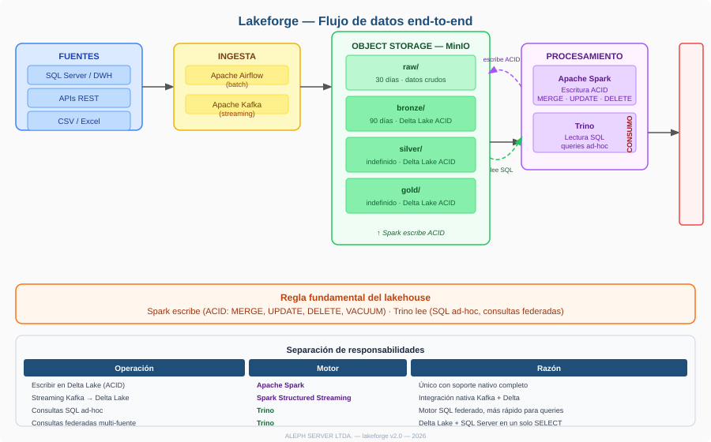
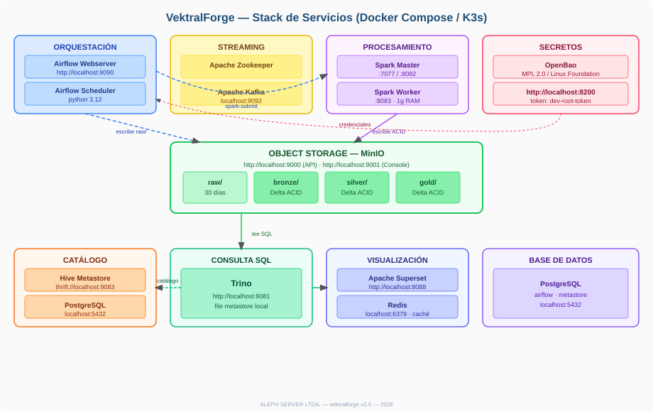
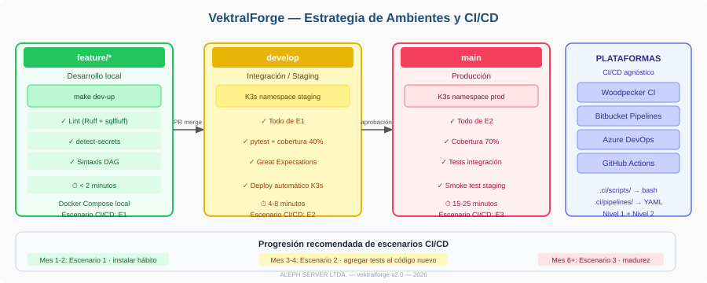
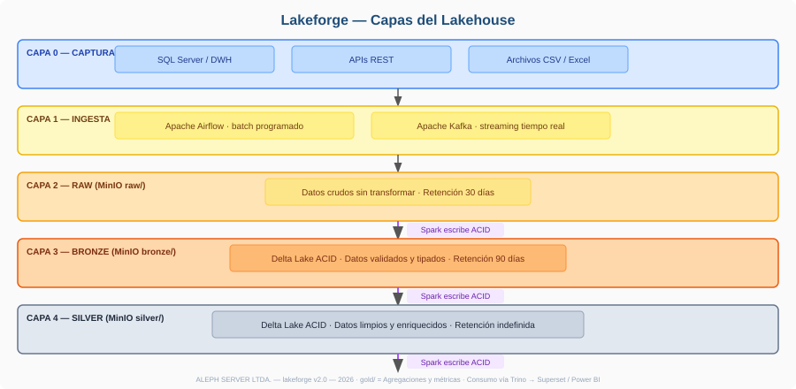
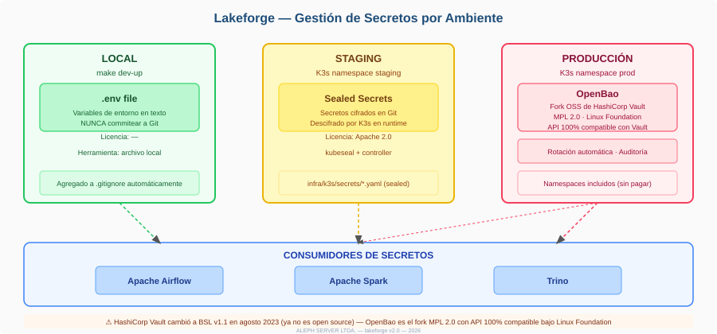
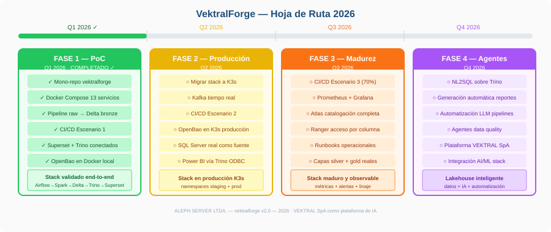

# VektralForge — Arquitectura

Documento técnico de referencia. Describe el stack tal como está implementado,
no como se planea que esté.

## Convenciones de madurez

Las insignias indican qué está realmente funcionando. Un componente marcado
`Operativo` se levanta con `make dev-up` y participa en los pipelines de
ejemplo; uno `Planificado` no está en el stack todavía.

| Insignia | Significado |
|---|---|
| `Operativo` | En el stack, levanta con `make dev-up` y se usa en los pipelines |
| `Parcial` | Presente en el stack, sin integración completa |
| `Planificado` | Decidido pero no implementado |
| `En evaluación` | Considerado, sin decisión tomada |

---

## 1. Qué es

VektralForge integra Apache Airflow, Spark, Delta Lake, Trino y Superset en un
stack desplegable, con trazabilidad de extremo a extremo mediante OpenLineage y
Marquez. Corre en local con Docker Compose y está pensado para producción sobre
K3s.

El proyecto está patrocinado por ALEPH SERVER LTDA. y gobernado de forma
independiente — ver [GOVERNANCE.md](../GOVERNANCE.md).

---

## 2. Stack

| Componente | Versión | Estado | Rol |
|---|---|---|---|
| Apache Airflow | 3.3.0 | `Operativo` | Orquestación |
| Apache Spark | 4.0.0 | `Operativo` | Procesamiento y escritura ACID |
| Delta Lake | 4.0.0 | `Operativo` | Formato de tabla transaccional |
| Hive Metastore | 4.0.0 | `Operativo` | Catálogo compartido Spark ↔ Trino |
| Trino | 448 | `Operativo` | Consulta SQL |
| MinIO | 2024-04 | `Operativo` | Almacenamiento de objetos S3 |
| Apache Superset | 3.1.3 | `Operativo` | Visualización |
| OpenLineage | 1.52.0 | `Operativo` | Linaje en Airflow y Spark |
| Marquez | — | `Operativo` | Almacén y UI de linaje |
| PostgreSQL | 15 | `Operativo` | Metadatos de Airflow, Hive, Marquez y Superset |
| Redis | 7.2 | `Operativo` | Caché de Superset |
| OpenBao | 2.1.0 | `Parcial` | Secretos; en local corre en modo dev |
| Apache Kafka | 7.6.1 (CP) | `Parcial` | En el stack, sin pipeline de streaming aún |
| Docker Compose | — | `Operativo` | Entorno local |
| K3s / Kubernetes | — | `Planificado` | Plataforma de producción |
| Sealed Secrets | — | `En evaluación` | Alternativa a OpenBao para K3s |
| Great Expectations | — | `Planificado` | Calidad de datos |
| Prometheus + Grafana | — | `Planificado` | Métricas |
| Graylog | — | `En evaluación` | Logs; su licencia SSPL es un factor en la decisión |

El linaje se emite en dos niveles: el provider de OpenLineage de Airflow publica
el run de cada tarea, y el `OpenLineageSparkListener` publica los datasets que
lee y escribe cada job de Spark. El listener se declara en el
`spark-defaults.conf` compartido por las imágenes de Airflow y Spark —con
`SparkSubmitOperator` el driver corre en el contenedor de Airflow, así que tiene
que estar en ambas—, y Airflow inyecta el parent job y el transporte en cada
submit con `AIRFLOW__OPENLINEAGE__SPARK_INJECT_PARENT_JOB_INFO` y
`AIRFLOW__OPENLINEAGE__SPARK_INJECT_TRANSPORT_INFO`. Sin esa inyección los dos
runs llegarían a Marquez como grafos inconexos.

Sobre el linaje: se usa **OpenLineage con Marquez**, no Apache Atlas. Atlas
cubre catalogación además de linaje, pero OpenLineage tiene integración nativa
con Airflow y Spark, y Marquez es su implementación de referencia bajo la Linux
Foundation.

Sobre control de acceso: **no hay una capa transversal**. Trino usa
`delta.security=ALLOW_ALL` en desarrollo y Airflow gestiona usuarios con
FabAuthManager. Apache Ranger daría políticas unificadas a nivel de tabla,
columna y fila, pero no está implementado.

Las licencias de terceros, incluidas MinIO (AGPLv3) y Graylog (SSPL), están en
[THIRD-PARTY-NOTICES.md](../THIRD-PARTY-NOTICES.md).

Python **3.12** en todo el stack: driver y executors de Spark deben coincidir en
versión menor o PySpark rechaza la ejecución.

---

## 3. Flujo de datos



**Spark escribe, Trino lee.** Las operaciones ACID sobre Delta Lake —`MERGE`,
`UPDATE`, `DELETE`, `VACUUM`— solo las hace Spark. Trino aporta consulta SQL
interactiva sobre las mismas tablas.

Ambos comparten el Hive Metastore, de modo que una tabla escrita por Spark es
consultable desde Trino sin registrarla dos veces. Esa decisión tiene un costo:
el metastore necesita el conector S3A y su propia configuración de credenciales,
porque valida rutas en el object store al gestionar esquemas externos.

El cliente de metastore que Spark 4 lleva embebido es Hive 2.3.10 y el servidor
es 4.0.0. Es la combinación habitual del ecosistema y está validada en ejecución
en este stack; alinearla exigiría gestionar un segundo juego de jars de Hive sin
ganancia funcional. Ver las notas de compatibilidad del README.

El mecanismo concreto: los jobs abren la sesión con `enableHiveSupport()` y
`spark.hadoop.hive.metastore.uris`, crean la base con
`CREATE DATABASE IF NOT EXISTS bronze LOCATION 's3a://bronze/'` y escriben con
`saveAsTable`. Como la base apunta a la raíz del bucket, cada tabla se
materializa en `s3a://bronze/<tabla>/` —la misma ruta que antes se escribía a
mano— pero además queda en el catálogo.

**La banda de incertidumbre se calcula, no se copia.** La API de ARClim devuelve
`series` (20 modelos × 100 años) y `pseries` (20 modelos × 11 percentiles). El
job calcula `valor_p10` y `valor_p90` como percentiles sobre los 20 modelos de
cada año, que es la presentación estándar de una proyección climática. `pseries`
no sirve para eso y leerlo por posición —como se hacía— metía los once
percentiles del primer modelo en los once primeros años y dejaba los otros 89 en
nulo: el 89 % de la columna estaba vacío y el 11 % restante era una curva de
percentiles disfrazada de serie temporal.

**El cierre de la sesión espera al emisor de linaje.** OpenLineage emite de
forma asíncrona y no ofrece ninguna forma de forzar el vaciado de la cola. Cerrar
la sesión justo después de la última escritura pierde los eventos de ese último
segundo: los jobs llegan a Marquez pero los datasets de las últimas tablas no.
Se midió con `arclim_series`, `indicadores_utm` e `indicadores_tpm`, y empeoró al
pasar a `replaceWhere`, que emite dos eventos por escritura en vez de uno. Los
jobs esperan unos segundos antes de `spark.stop()`; se ajusta con
`OPENLINEAGE_PAUSA_CIERRE`.

**Extracción idempotente y cache en `raw/`.** La zona de aterrizaje guarda la
respuesta cruda de la API particionada por fecha, así que ya es el cache natural:
`extract` comprueba qué hay antes de pedir. ARClim lo hace archivo por archivo,
de modo que una descarga interrumpida se reanuda por donde iba; indicadores usa
`resumen.json`, que se escribe al final, como marca de fecha completa. El
parámetro `forzar_descarga` ignora el cache.

El cliente HTTP vive en `airflow/plugins/`, no en `airflow/dags/`: Airflow 3 pone
la carpeta de plugins en el `sys.path` de quien parsea los DAGs, pero no la de
DAGs. Un módulo compartido en `dags/` falla con `ModuleNotFoundError` dentro del
contenedor aunque los tests pasen —el `conftest` lo añadía a mano y tapaba el
problema—, así que ahora los tests apuntan a `plugins/` y no a `dags/`.

Los errores de red no se confunden con ausencia de datos: `get_json` lanza
`ErrorAPI` en vez de devolver `None`. Antes un 429 y una serie vacía llegaban
iguales a quien llamaba, y el resultado era un pipeline que perdía datos en
silencio.

**Escrituras idempotentes.** Los jobs no hacen `append` ciego: escriben con
`mode("overwrite")` y `replaceWhere` sobre la columna de fecha de carga, de modo
que reejecutar un DAG reemplaza esa carga en vez de añadir una copia. Delta
valida que todas las filas escritas cumplan el predicado, así que una fila con
la fecha equivocada hace fallar la escritura en lugar de colarse.

Eso resuelve la reejecución, no la concurrencia: dos runs escribiendo la misma
fecha a la vez seguirían pisándose, así que los DAGs declaran
`max_active_runs=1`. El caso no es hipotético — `airflow dags unpause` en
`load_example.sh` disparaba el run programado del día en paralelo con el manual,
y las tablas bronze acababan con cada fila dos veces.

**Spark es el único escritor del catálogo.** El schema no se crea desde Trino: si
se creara allí quedaría fijado con `location = 's3://bronze/'` y Spark ya no
podría declarar la suya. Trino conserva `register_table` habilitado, pero los
pipelines del repo no lo usan; sirve para adoptar tablas Delta preexistentes.

Trino cachea los metadatos de cada tabla `delta.metadata.cache-ttl` (10 min en
esta configuración), así que un cambio de esquema puede tardar en verse aunque
la tabla aparezca de inmediato en `SHOW TABLES`.

---

## 4. Arquitectura de servicios



`SparkSubmitOperator` ejecuta `spark-submit` desde el contenedor de Airflow, no
desde el de Spark. Eso evita montar el socket de Docker —que daría a Airflow
control del demonio del host— a cambio de que la imagen de Airflow necesite una
JVM y los mismos JAR que el cluster.

---

## 5. Estructura del repositorio

```
vektralforge/
├── airflow/
│   ├── dags/                  # DAGs de los pipelines
│   ├── plugins/               # Operadores y hooks propios
│   ├── tests/                 # Tests de DAGs
│   ├── requirements.txt       # Dependencias de ejecución
│   └── requirements-dev.txt   # Herramientas de desarrollo
├── spark/
│   ├── jobs/                  # Jobs PySpark
│   ├── tests/                 # Tests de jobs
│   ├── requirements.txt
│   └── requirements-dev.txt
├── trino/catalog/             # Catálogos de Trino
├── superset/dashboards/       # Scripts de configuración de dashboards
├── infra/
│   ├── docker-compose/        # Stack local y Dockerfiles
│   ├── k3s/                   # Manifiestos Kubernetes
│   └── helm/                  # Charts propios
├── .ci/scripts/               # Lógica de lint, test y deploy
├── .github/workflows/         # CI en GitHub Actions
├── docs/
│   ├── arquitectura.md
│   ├── brand/                 # Activos de marca
│   └── img/                   # Diagramas SVG
├── Makefile
└── README.md
```

Las dependencias están separadas en `requirements.txt` y `requirements-dev.txt`
a propósito: las herramientas de test no forman parte del entorno de ejecución,
y tenerlas fuera evita que un CVE de una herramienta aparezca como
vulnerabilidad de producción.

---

## 6. CI/CD

La lógica vive en **`.ci/scripts/`** —scripts bash con lint, tests, escaneo de
secretos y deploy— y los workflows de `.github/workflows/` solo los invocan.

La portabilidad está en los scripts, no en mantener un YAML por plataforma:
migrar a otro CI significa escribir un archivo que llame a los mismos scripts.
El proyecto tuvo adaptadores para Bitbucket, Azure y Woodpecker que nunca se
ejecutaron y habrían fallado; se eliminaron por eso.

### Workflows

| Workflow | Se ejecuta en | Verifica |
|---|---|---|
| `ci.yml` | Pull requests, push a `main` y `develop` | Lint, tests, escaneo de secretos |
| `dco.yml` | Pull requests | Firma DCO en cada commit |

CodeQL corre por el *default setup* de GitHub Advanced Security, sin workflow
propio.

### Ramas



| Rama | Destino | Verificación |
|---|---|---|
| `feature/*` | Local | CI completo en el pull request |
| `develop` | Staging (K3s) — `Planificado` | CI completo |
| `main` | Producción (K3s) — `Planificado` | CI completo |

### Qué no cubre el CI

Nadie comprueba que el stack levante. Los tests verifican que los DAGs se
parsean y que las funciones puras hacen lo suyo, pero `make dev-up` y
`make dev-load-example` no se ejecutan en CI: requieren Docker y del orden de
diez minutos. Es la comprobación que más valdría tener y también la más cara;
lo habitual es dejarla como ejecución nocturna.

---

## 7. Capas del lakehouse



| Capa | Contenido | Retención prevista |
|---|---|---|
| `raw/` | Respuesta cruda de la fuente, sin transformar | 30 días |
| `bronze/` | Tablas Delta tipadas | 90 días |
| `silver/` | Modelos limpios y deduplicados | Indefinido |
| `gold/` | Agregados para consumo | Indefinido |

Las políticas de retención son de diseño: **no hay lifecycle policies
configuradas en MinIO ni un DAG de `VACUUM`**. Delta conserva todas las
versiones hasta que alguien las purgue.

---

## 8. Secretos



| Entorno | Herramienta | Estado |
|---|---|---|
| Local | `.env` | `Operativo` |
| Staging | Sealed Secrets | `En evaluación` |
| Producción | OpenBao | `Planificado` |

Ningún archivo del repositorio contiene credenciales. Los que las necesitan
—`marquez.yml`, el `core-site.xml` del metastore— se generan al arrancar el
contenedor a partir del `.env`, y los catálogos de Trino usan interpolación
`${ENV:...}` en tiempo de ejecución.

Las credenciales de MinIO se propagan **solo por variables de entorno**
(`AWS_ACCESS_KEY_ID` y `AWS_SECRET_ACCESS_KEY`, derivadas en el Compose de
`MINIO_ROOT_USER` y `MINIO_ROOT_PASSWORD`), nunca como propiedades de Spark.
Una propiedad pasada con `--conf` viaja en la línea de comandos del proceso:
queda en el `ps` del contenedor de Airflow y en `/proc/<pid>/cmdline`, aunque
`SparkSubmitHook` la enmascare en el log y Spark la redacte en la UI del driver.
S3A las resuelve con
`software.amazon.awssdk.auth.credentials.EnvironmentVariableCredentialsProvider`
y boto3 con su cadena por defecto.

En local, OpenBao corre en modo `-dev`: almacenamiento en memoria y sellado
automático. No es una configuración de producción.

### Cliente Python

```python
import os

import hvac

client = hvac.Client(
    url=os.environ["OPENBAO_ADDR"],
    token=os.environ["OPENBAO_TOKEN"],
)
secreto = client.secrets.kv.v2.read_secret_version(path="ejemplo/credenciales")
password = secreto["data"]["data"]["password"]
```

---

## 9. Pipelines de ejemplo

| DAG | Fuente | Frecuencia |
|---|---|---|
| `indicadores_financieros_chile` | mindicador.cl | Lunes a viernes, 10:00 |
| `arclim_riesgo_climatico_chile` | ARClim — Ministerio del Medio Ambiente | Lunes, 06:00 |

Ambas APIs son públicas y no requieren clave, de modo que cualquiera que clone
el repositorio puede ejecutar los pipelines completos sin registrarse en ningún
sitio. Fue un criterio de selección: un ejemplo que necesita credenciales no es
un ejemplo.

Cada DAG sigue el mismo patrón: extracción a `raw/`, transformación a Delta en
`bronze/` con Spark, y validación de que los datos llegaron. Los jobs salen con
código distinto de cero si ninguna tabla se escribió, para que un fallo no se
reporte como éxito.

---

## 10. Servicios locales

| Servicio | URL |
|---|---|
| Airflow | http://localhost:8090 |
| Superset | http://localhost:8088 |
| Trino | http://localhost:8081 |
| MinIO | http://localhost:9001 |
| Marquez | http://localhost:3000 |
| Spark Master | http://localhost:8082 |
| OpenBao | http://localhost:8200 |

Las credenciales salen de `infra/docker-compose/.env` y se muestran al terminar
`make dev-up`.

---

## 11. Hardware

### Entorno de desarrollo

Docker Desktop con al menos **8 GB de RAM** asignados. Con menos, los
contenedores mueren por OOM.

### Servidor único

| Componente | Mínimo | Recomendado |
|---|---|---|
| CPU | 8 núcleos | 16 núcleos |
| RAM | 32 GB | 64 GB |
| Disco de sistema | 100 GB SSD | 200 GB SSD |
| Disco de datos | 500 GB HDD | 2 TB SSD |

Referencia de costo: Hetzner AX42 (16 núcleos, 64 GB, 2×512 GB NVMe), unos
EUR 79 al mes.

### Cluster K3s — `Planificado`

| Nodo | Rol | CPU | RAM | Datos |
|---|---|---|---|---|
| node-1 | Control plane, Airflow, OpenBao | 8 núcleos | 32 GB | — |
| node-2 | Spark, Trino | 16 núcleos | 64 GB | — |
| node-3 | MinIO, Kafka, Marquez | 8 núcleos | 32 GB | 4 TB |
| **Total** | | **32 núcleos** | **128 GB** | **4 TB** |

---

## 12. Decisiones de arquitectura

### OpenBao en lugar de HashiCorp Vault

HashiCorp cambió Vault a BSL 1.1 en agosto de 2023, una licencia
source-available que no aprueba la OSI. OpenBao es el fork bajo Linux
Foundation, mantiene MPL 2.0 y su API es compatible.

| Aspecto | Vault | OpenBao |
|---|---|---|
| Licencia | BSL 1.1 | MPL 2.0 |
| Gobernanza | HashiCorp / IBM | Linux Foundation + OpenSSF |
| Namespaces | Solo Enterprise | Incluido |

### OpenLineage en lugar de Apache Atlas

OpenLineage tiene integración nativa con Airflow y Spark: el linaje se captura
sin instrumentar los pipelines a mano. Atlas cubre además catalogación de
metadatos, que OpenLineage no, y sigue siendo una opción si esa necesidad
aparece.

### Metastore compartido en lugar de catálogos separados

Trino puede mantener su propio catálogo en disco, que es más simple. Compartir
el Hive Metastore con Spark exige darle el conector S3A y credenciales propias,
pero es lo que hace que una tabla escrita por Spark aparezca en Trino sin un
paso de registro adicional.

### Spark 4 y Scala 2.13

Spark 4 solo se publica para Scala 2.13, así que todas las coordenadas de JAR
cambian respecto a Spark 3.5. Además Hadoop 3.4 migró del AWS SDK v1 al v2: el
artefacto pasa de `com.amazonaws:aws-java-sdk-bundle` a
`software.amazon.awssdk:bundle`, que es otro paquete y no una versión nueva del
mismo. Los Dockerfiles resuelven esos JAR con Maven en vez de fijarlos a mano,
porque `hadoop-aws` hereda la versión del SDK de su POM padre.

---

## 13. Hoja de ruta



| Fase | Hito |
|---|---|
| 1 — Base | Stack local, dos pipelines, linaje, CI, gobernanza ✓ |
| 2 — Producción | K3s, secretos gestionados, Kafka en streaming |
| 3 — Madurez | Calidad de datos, métricas, control de acceso |
| 4 — Exploración | Consulta en lenguaje natural sobre el catálogo |

Las fechas dependen de la disponibilidad de quienes mantienen el proyecto. Ver
las issues del repositorio para lo que está en curso.

---

*Apache 2.0 · Copyright The VektralForge Authors*
